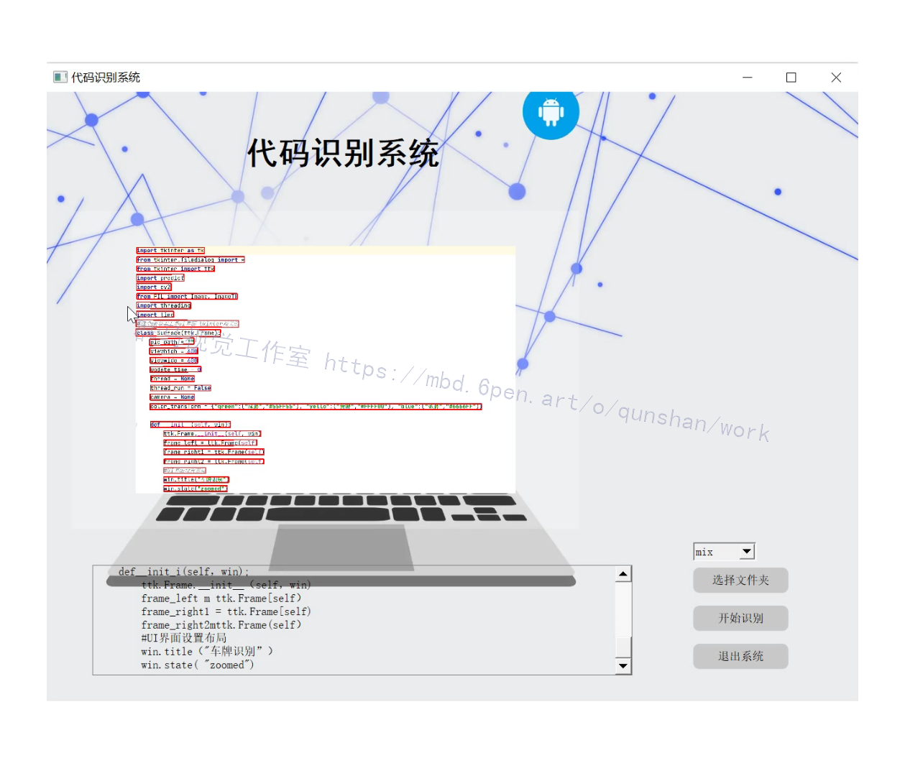
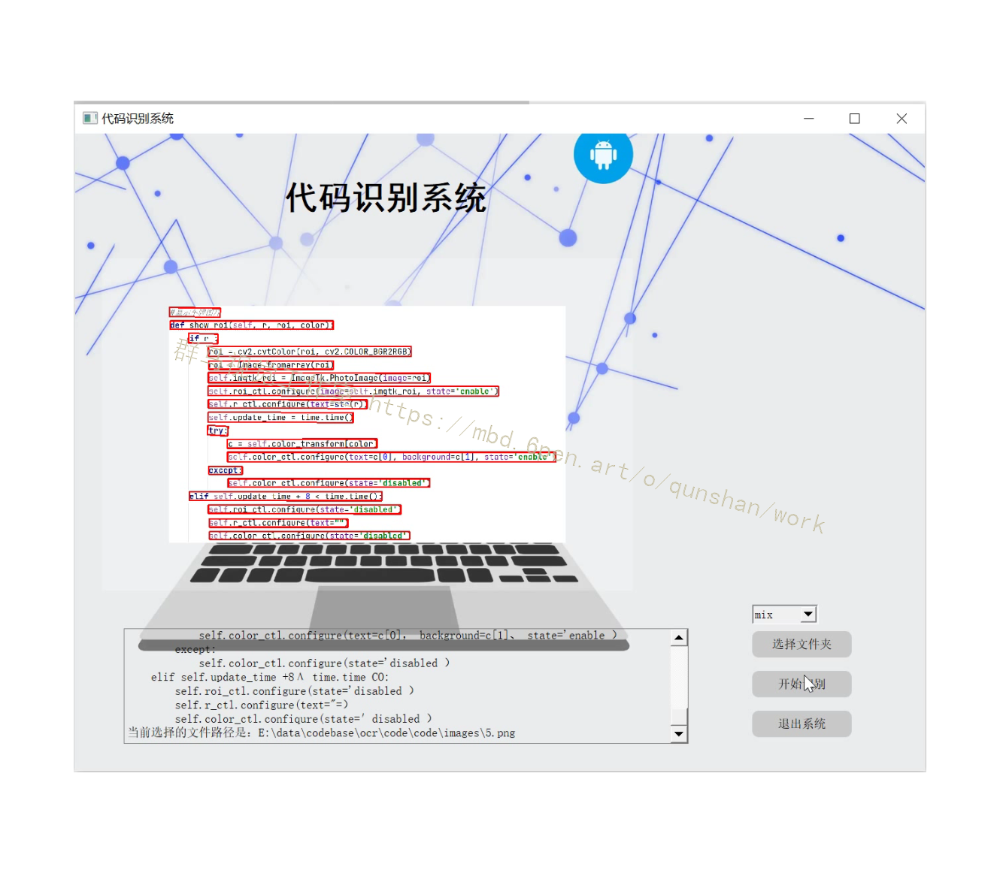
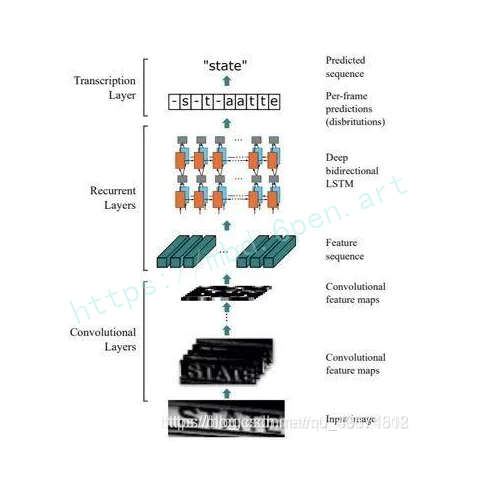
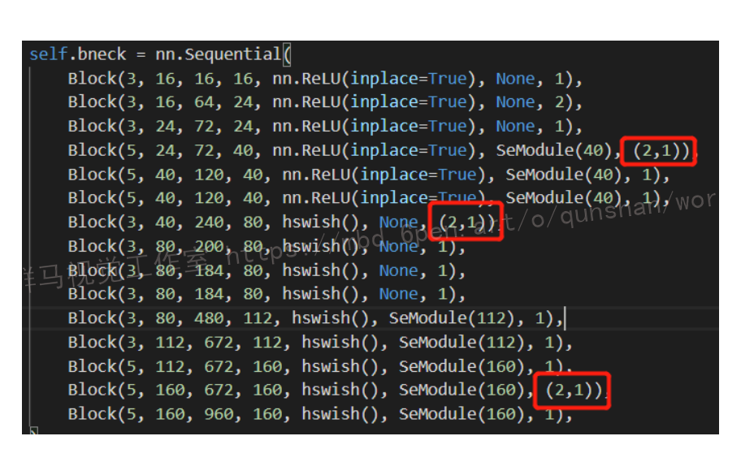
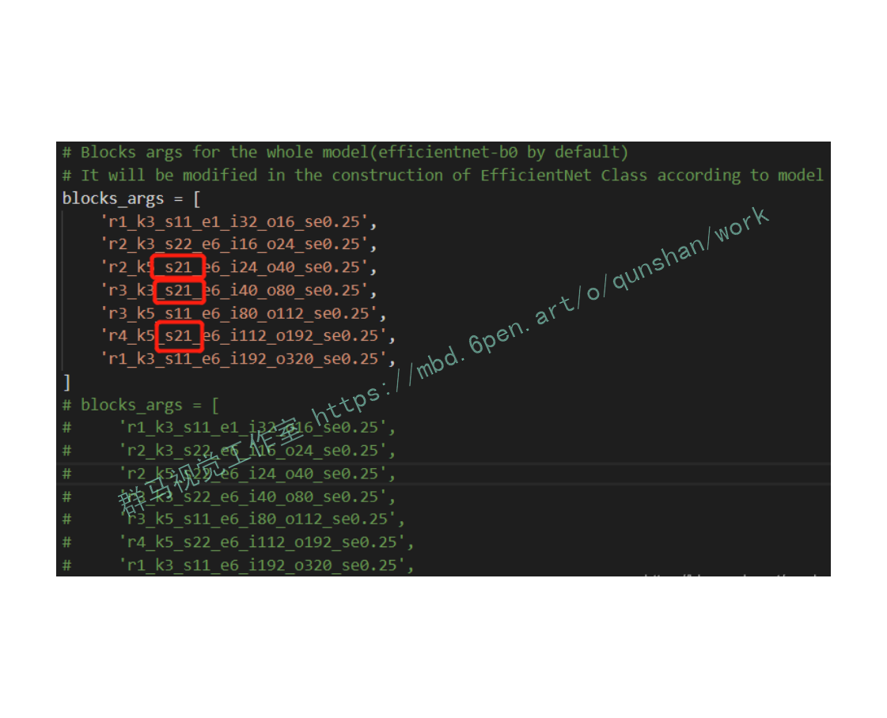
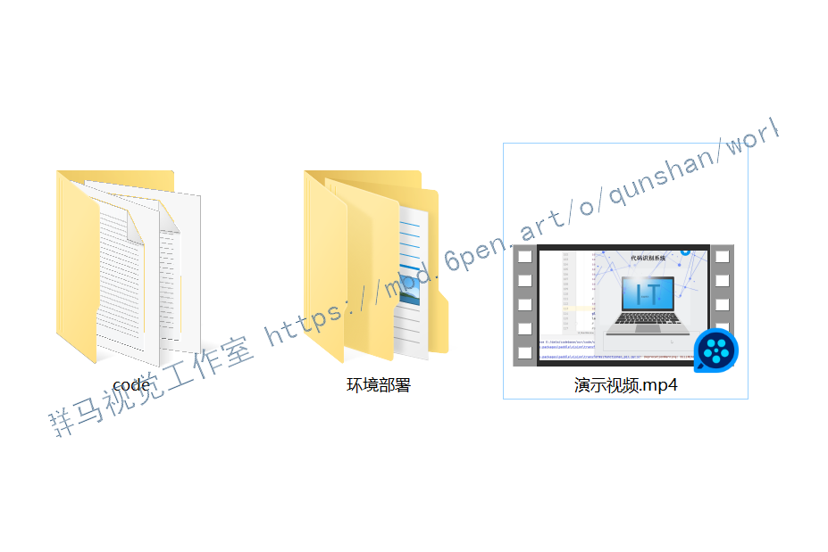


# 1.研究背景
代码的识别与自动重构是近年来软件工程的热点领域之一,而重复代码是一种在软件工程中较为常见的代码.本文在基于文本的重复代码识别方法的基础上,通过词法分析对特定的Token作出处理后再对源代码进行对比,最后通过语法树的对比来对结果进行过滤以降低误报率.测试结果表明该方法对于重复代码有着较好的识别效果.对重复代码的自动识别算法研究有着借鉴意义,在软件的质量、维护等领域上也具有广泛的应用需求.

# 2.图片演示




# 3.视频演示
[基于改进CRNN的代码＆缩进排版检测系统（源码＆教程）_哔哩哔哩_bilibili](https://www.bilibili.com/video/BV1z44y1Z7JH/?vd_source=bc9aec86d164b67a7004b996143742dc)


# 4.CRNN简介
是目前较为流行的图文识别模型，可识别较长的文本序列， 它利用BLSTM和CTC部件学习字符图像中的上下文关系， 从而有效提升文本识别准确率，使得模型更加鲁棒。 CRNN是一种卷积循环神经网络结构，用于解决基于图像的序列识别问题，特别是场景文字识别问题。 文章认为文字识别是对序列的预测方法，所以采用了对序列预测的RNN网络。通过CNN将图片的特征提取出来后采用RNN对序列进行预测，最后通过一个CTC的翻译层得到最终结果。说白了就是CNN+RNN+CTC的结构。

CRNN 全称为 Convolutional Recurrent Neural Network，主要用于端到端地对不定长的文本序列进行识别，不用先对单个文字进行切割，而是将文本识别转化为时序依赖的序列学习问题，就是基于图像的序列识别。

原文链接：https://blog.csdn.net/bestrivern/article/details/91050960


# 5.CRNN改进
#### 基于mobilenetv3的CRNN
mobilenetv3没有官网实现，高星实现: [mobilenetv3](https://mbd.pub/o/bread/Y52YlJpu)为基础模型。
如下图红框部分所示，将倒数3个s 由2改为（2,1）


#### 基于efficientnet的CRNN
efficientnet没有官网实现，高星实现: [efficientnet](https://afdian.net/item?plan_id=751b3c9a7ec611edac0b52540025c377)为基础模型
如下图红框部分所示，将倒数3个s 由s22改为s21


# 6.代码实现
```
# CRNN网络模型
#################### 自己写的代码这里开始 ################### 
class CRNN(object):
    def __init__(self,
                 num_classes,  # 类别数量
                 label_dict):  # 标签字典
        self.outputs = None  # 输出
        self.label_dict = label_dict  # 标签字典
        self.num_classes = num_classes  # 类别数量
 
    def name(self):
        return "crnn"
 
    def conv_bn_pool(self, input, group,  # 输入,组
                     out_ch,  # 输入通道数
                     act="relu",  # 激活函数
                     param=None, bias=None,  # 参数、权重初始值
                     param_0=None, is_test=False,
                     pooling=True,  # 是否执行池化
                     use_cudnn=False):  # 是否对cuda加速
        tmp = input
 
        for i in six.moves.xrange(group):
            # for i in range(group): # 也可以
            # 卷积层
            tmp = fluid.layers.conv2d(
                input=tmp,  # 输入
                num_filters=out_ch[i],  # num_filters (int) - 滤波器（卷积核）的个数。和输出图像通道相同。
                filter_size=3,##滤波器大小
                padding=1,##填充大小
                param_attr=param if param_0 is None else param_0,##指定权重参数属性的对象
                act=None,
                use_cudnn=use_cudnn)
            # 批量归一化
            tmp = fluid.layers.batch_norm(
                input=tmp,  # 前面卷基层输出作为输入
                act=act,  # 激活函数
                param_attr=param,  # 参数初始值
                bias_attr=bias,  # 偏置初始值
                is_test=is_test)  # 测试模型
        # 根据传入的参数决定是否做池化操作
        if pooling:
            tmp = fluid.layers.pool2d(
                input=tmp,  # 前一层的输出作为输入
                pool_size=2,  # 池化区域
                pool_type="max",  # 池化类型
                pool_stride=2,  # 步长
                use_cudnn=use_cudnn,
                ceil_mode=True)  # 输出高度计算公式
        return tmp
 
    # 包含4个卷积层操作
    def ocr_convs(self, input,
                  regularizer=None,  # 正则化
                  gradient_clip=None,  # 梯度裁剪，防止梯度过大
                  is_test=False, use_cudnn=False):
 ###创建一个参数属性对象，用户可设置参数的名称、初始化方式、学习率、正则化规则、是否需要训练、梯度裁剪方式、是否做模型平均等属性。
        b = fluid.ParamAttr(
            regularizer=regularizer,
            gradient_clip=gradient_clip,
            initializer=fluid.initializer.Normal(0.0, 0.0))
        w0 = fluid.ParamAttr(
            regularizer=regularizer,
            gradient_clip=gradient_clip,
            initializer=fluid.initializer.Normal(0.0, 0.0005))
        w1 = fluid.ParamAttr(
            regularizer=regularizer,
            gradient_clip=gradient_clip,
            initializer=fluid.initializer.Normal(0.0, 0.01))
 
        tmp = input
 
        # 第一组卷积池化
        tmp = self.conv_bn_pool(tmp,
                                2, [16, 16],  # 组数量及卷积核数量
                                param=w1,
                                bias=b,
                                param_0=w0,
                                is_test=is_test,
                                use_cudnn=use_cudnn)
        # 第二组卷积池化
        tmp = self.conv_bn_pool(tmp,
                                2, [32, 32],  # 组数量及卷积核数量
                                param=w1,
                                bias=b,
                                is_test=is_test,
                                use_cudnn=use_cudnn)
        # 第三组卷积池化
        tmp = self.conv_bn_pool(tmp,
                                2, [64, 64],  # 组数量及卷积核数量
                                param=w1,
                                bias=b,
                                is_test=is_test,
                                use_cudnn=use_cudnn)
        # 第四组卷积池化
        tmp = self.conv_bn_pool(tmp,
                                2, [128, 128],  # 组数量及卷积核数量
                                param=w1,
                                bias=b,
                                is_test=is_test,
                                pooling=False,  # 不做池化
                                use_cudnn=use_cudnn)
        return tmp
 
    # 组网
    def net(self, images,
            rnn_hidden_size=200,  # 隐藏层输出值数量
            regularizer=None,  # 正则化
            gradient_clip=None,  # 梯度裁剪，防止梯度过大
            is_test=False,
            use_cudnn=True):
        # 卷积池化
        conv_features = self.ocr_convs(
            images,
            regularizer=regularizer,
            gradient_clip=gradient_clip,
            is_test=is_test,
            use_cudnn=use_cudnn)
        # 将特征图转为序列
        sliced_feature = fluid.layers.im2sequence(
            input=conv_features,  # 卷积得到的特征图作为输入
            stride=[1, 1],
            # 卷积核大小(高度等于原高度，宽度1)
            filter_size=[conv_features.shape[2], 1])
        # 两个全连接层
        para_attr = fluid.ParamAttr(
            regularizer=regularizer,  # 正则化
            gradient_clip=gradient_clip,
            initializer=fluid.initializer.Normal(0.0, 0.02))
        bias_attr = fluid.ParamAttr(
            regularizer=regularizer,  # 正则化
            gradient_clip=gradient_clip,
            initializer=fluid.initializer.Normal(0.0, 0.02))
        bias_attr_nobias = fluid.ParamAttr(
            regularizer=regularizer,  # 正则化
            gradient_clip=gradient_clip,
            initializer=fluid.initializer.Normal(0.0, 0.02))
 
        fc_1 = fluid.layers.fc(
            input=sliced_feature,  # 序列化处理的特征图
            size=rnn_hidden_size * 3,
            param_attr=para_attr,
            bias_attr=bias_attr_nobias)
        fc_2 = fluid.layers.fc(
            input=sliced_feature,  # 序列化处理的特征图
            size=rnn_hidden_size * 3,
            param_attr=para_attr,
            bias_attr=bias_attr_nobias)
 
        # 双向GRU(门控循环单元，LSTM变种, LSTM是RNN变种)
        gru_foward = fluid.layers.dynamic_gru(
            input=fc_1,
            size=rnn_hidden_size,
            param_attr=para_attr,
            bias_attr=bias_attr,
            candidate_activation="relu")
        gru_backward = fluid.layers.dynamic_gru(
            input=fc_2,
            size=rnn_hidden_size,
            is_reverse=True,  # 反向循环神经网络
            param_attr=para_attr,
            bias_attr=bias_attr,
            candidate_activation="relu")
        # 输出层
        w_attr = fluid.ParamAttr(
            regularizer=regularizer,
            gradient_clip=gradient_clip,
            initializer=fluid.initializer.Normal(0.0, 0.02))
        b_attr = fluid.ParamAttr(
            regularizer=regularizer,
            gradient_clip=gradient_clip,
            initializer=fluid.initializer.Normal(0.0, 0.0))
 
        fc_out = fluid.layers.fc(
            input=[gru_foward, gru_backward],  # 双向RNN输出作为输入
            size=self.num_classes + 1,  # 输出类别
            param_attr=w_attr,
            bias_attr=b_attr)
 
        self.outputs = fc_out
        return fc_out
 
    def get_infer(self):
        # 将CRNN网络输出交给CTC层转录(纠错、去重)
        return fluid.layers.ctc_greedy_decoder(
            input=self.outputs, # 输入为CRNN网络输出
            blank=self.num_classes)

```

# 7.系统整合
下图[完整源码＆环境部署视频教程＆自定义UI界面](https://s.xiaocichang.com/s/3ed126)：

参考博客[《基于改进CRNN的代码＆缩进排版检测系统（源码＆教程）》](https://mbd.pub/o/qunma/work)

# 8.参考文献
***
[1][杨勋姮](https://s.wanfangdata.com.cn/paper?q=%E4%BD%9C%E8%80%85:%22%E6%9D%A8%E5%8B%8B%E5%A7%AE%22),[段明璐](https://s.wanfangdata.com.cn/paper?q=%E4%BD%9C%E8%80%85:%22%E6%AE%B5%E6%98%8E%E7%92%90%22).[软件缺陷分析技术的研究](https://d.wanfangdata.com.cn/periodical/ranj201802019)[J].[软件](https://sns.wanfangdata.com.cn/perio/ranj).2018,(2).DOI:[10.3969/j.issn.1003-6970.2018.02.019](http://dx.chinadoi.cn/10.3969/j.issn.1003-6970.2018.02.019).

[2][段明璐](https://s.wanfangdata.com.cn/paper?q=%E4%BD%9C%E8%80%85:%22%E6%AE%B5%E6%98%8E%E7%92%90%22).[软件故障树算法建模的研究](https://d.wanfangdata.com.cn/periodical/ranj201802015)[J].[软件](https://sns.wanfangdata.com.cn/perio/ranj).2018,(2).DOI:[10.3969/j.issn.1003-6970.2018.02.015](http://dx.chinadoi.cn/10.3969/j.issn.1003-6970.2018.02.015).

[3][印杰](https://s.wanfangdata.com.cn/paper?q=%E4%BD%9C%E8%80%85:%22%E5%8D%B0%E6%9D%B0%22),[李千目](https://s.wanfangdata.com.cn/paper?q=%E4%BD%9C%E8%80%85:%22%E6%9D%8E%E5%8D%83%E7%9B%AE%22).[软件代码漏洞的电子取证技术综述](https://d.wanfangdata.com.cn/periodical/ranj201512012)[J].[软件](https://sns.wanfangdata.com.cn/perio/ranj).2015,(12).DOI:[10.3969/j.issn.1003-6970.2015.12.012](http://dx.chinadoi.cn/10.3969/j.issn.1003-6970.2015.12.012).

[4][翁秀木](https://s.wanfangdata.com.cn/paper?q=%E4%BD%9C%E8%80%85:%22%E7%BF%81%E7%A7%80%E6%9C%A8%22).[一个通用的软件质量评估指标体系](https://d.wanfangdata.com.cn/periodical/ranj201503012)[J].[软件](https://sns.wanfangdata.com.cn/perio/ranj).2015,(3).DOI:[10.3969/j.issn.1003-6970.2015.03.012](http://dx.chinadoi.cn/10.3969/j.issn.1003-6970.2015.03.012).

[5][史庆庆](https://s.wanfangdata.com.cn/paper?q=%E4%BD%9C%E8%80%85:%22%E5%8F%B2%E5%BA%86%E5%BA%86%22),[孟繁军](https://s.wanfangdata.com.cn/paper?q=%E4%BD%9C%E8%80%85:%22%E5%AD%9F%E7%B9%81%E5%86%9B%22),[张丽萍](https://s.wanfangdata.com.cn/paper?q=%E4%BD%9C%E8%80%85:%22%E5%BC%A0%E4%B8%BD%E8%90%8D%22),等.[克隆代码技术研究综述](https://d.wanfangdata.com.cn/periodical/jsjyyyj201306004)[J].[计算机应用研究](https://sns.wanfangdata.com.cn/perio/jsjyyyj).2013,(6).DOI:[10.3969/j.issn.1001-3695.2013.06.004](http://dx.chinadoi.cn/10.3969/j.issn.1001-3695.2013.06.004).

[6][郭婧](https://s.wanfangdata.com.cn/paper?q=%E4%BD%9C%E8%80%85:%22%E9%83%AD%E5%A9%A7%22),[吴军华](https://s.wanfangdata.com.cn/paper?q=%E4%BD%9C%E8%80%85:%22%E5%90%B4%E5%86%9B%E5%8D%8E%22).[基于程序依赖图的克隆检测及改进](https://d.wanfangdata.com.cn/periodical/jsjgcysj201202036)[J].[计算机工程与设计](https://sns.wanfangdata.com.cn/perio/jsjgcysj).2012,(2).DOI:[10.3969/j.issn.1000-7024.2012.02.036](http://dx.chinadoi.cn/10.3969/j.issn.1000-7024.2012.02.036).

[7][于冬琦](https://s.wanfangdata.com.cn/paper?q=%E4%BD%9C%E8%80%85:%22%E4%BA%8E%E5%86%AC%E7%90%A6%22),[吴毅坚](https://s.wanfangdata.com.cn/paper?q=%E4%BD%9C%E8%80%85:%22%E5%90%B4%E6%AF%85%E5%9D%9A%22),[彭鑫](https://s.wanfangdata.com.cn/paper?q=%E4%BD%9C%E8%80%85:%22%E5%BD%AD%E9%91%AB%22),等.[基于相似性度量的面向对象程序方法级克隆侦测](https://d.wanfangdata.com.cn/periodical/dianzixb2010z1032)[J].[电子学报](https://sns.wanfangdata.com.cn/perio/dianzixb).2010,(z1).

[8][于冬琦](https://s.wanfangdata.com.cn/paper?q=%E4%BD%9C%E8%80%85:%22%E4%BA%8E%E5%86%AC%E7%90%A6%22),[彭鑫](https://s.wanfangdata.com.cn/paper?q=%E4%BD%9C%E8%80%85:%22%E5%BD%AD%E9%91%AB%22),[赵文耘](https://s.wanfangdata.com.cn/paper?q=%E4%BD%9C%E8%80%85:%22%E8%B5%B5%E6%96%87%E8%80%98%22).[使用抽象语法树和静态分析的克隆代码自动重构方法](https://d.wanfangdata.com.cn/periodical/xxwxjsjxt200909012)[J].[小型微型计算机系统](https://sns.wanfangdata.com.cn/perio/xxwxjsjxt).2009,(9).

[9][James R. Cordy](https://s.wanfangdata.com.cn/paper?q=%E4%BD%9C%E8%80%85:%22James%20R.%20Cordy%22),[Rainer Koschke](https://s.wanfangdata.com.cn/paper?q=%E4%BD%9C%E8%80%85:%22Rainer%20Koschke%22),[Chanchal K. Roy](https://s.wanfangdata.com.cn/paper?q=%E4%BD%9C%E8%80%85:%22Chanchal%20K.%20Roy%22).[Comparison and evaluation of code clone detection techniques and tools: A qualitative approach](https://d.wanfangdata.com.cn/periodical/ed5e28cd1bdb15f94d64e825f2dc4e83)[J].Science of Computer Programming.2009,74(7).

[10][Matthias Rieger](https://s.wanfangdata.com.cn/paper?q=%E4%BD%9C%E8%80%85:%22Matthias%20Rieger%22),[Stephane Ducasse](https://s.wanfangdata.com.cn/paper?q=%E4%BD%9C%E8%80%85:%22Stephane%20Ducasse%22),[Oscar Nierstrasz](https://s.wanfangdata.com.cn/paper?q=%E4%BD%9C%E8%80%85:%22Oscar%20Nierstrasz%22).[On the effectiveness of clone detection by string matching](https://d.wanfangdata.com.cn/periodical/05fb9a7f128f43c476b7cf52f484f887)[J].Journal of Software Maintenance & Evolution: Research & Practice.2006,18(1).


---
#### 如果您需要更详细的【源码和环境部署教程】，除了通过【系统整合】小节的链接获取之外，还可以通过邮箱以下途径获取:
#### 1.请先在GitHub上为该项目点赞（Star），编辑一封邮件，附上点赞的截图、项目的中文描述概述（About）以及您的用途需求，发送到我们的邮箱
#### sharecode@yeah.net
#### 2.我们收到邮件后会定期根据邮件的接收顺序将【完整源码和环境部署教程】发送到您的邮箱。
#### 【免责声明】本文来源于用户投稿，如果侵犯任何第三方的合法权益，可通过邮箱联系删除。